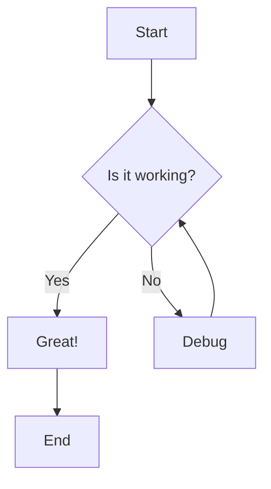
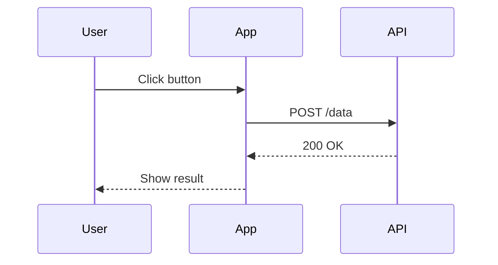
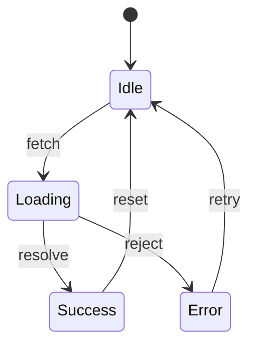
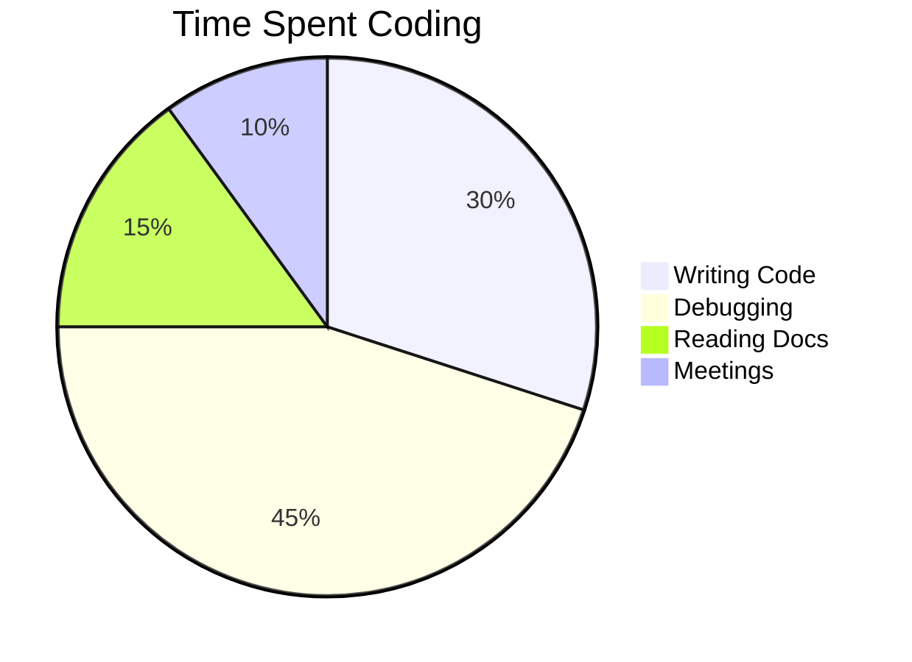

# Mermaid & Math Demo

## Mermaid Diagrams

### Flowchart

### Sequence Diagram

### State Diagram

### Pie Chart

---

## LaTeX Math

### Inline Math

The quadratic formula is $x = \frac{-b \pm \sqrt{b^2-4ac}}{2a}$ which solves $ax^2 + bx + c = 0$.

Einstein's famous equation: $E = mc^2$

### Block Math

$$
\int_{-\infty}^{\infty} e^{-x^2} dx = \sqrt{\pi}
$$

### Matrix

$$
\begin{bmatrix}
a & b \\
c & d
\end{bmatrix}
\begin{bmatrix}
x \\
y
\end{bmatrix}
=
\begin{bmatrix}
ax + by \\
cx + dy
\end{bmatrix}
$$

### Summation

$$
\sum_{n=1}^{\infty} \frac{1}{n^2} = \frac{\pi^2}{6}
$$

### Calculus

$$
\frac{d}{dx}\left( \int_{a}^{x} f(t)\,dt \right) = f(x)
$$
