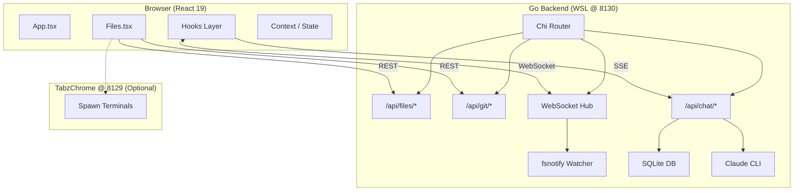
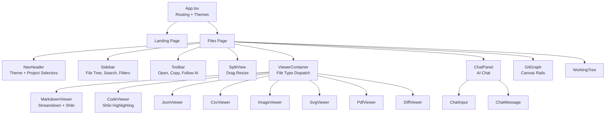
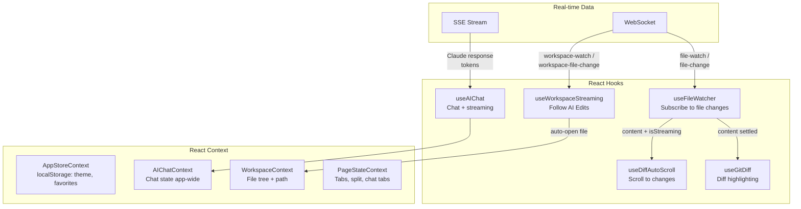
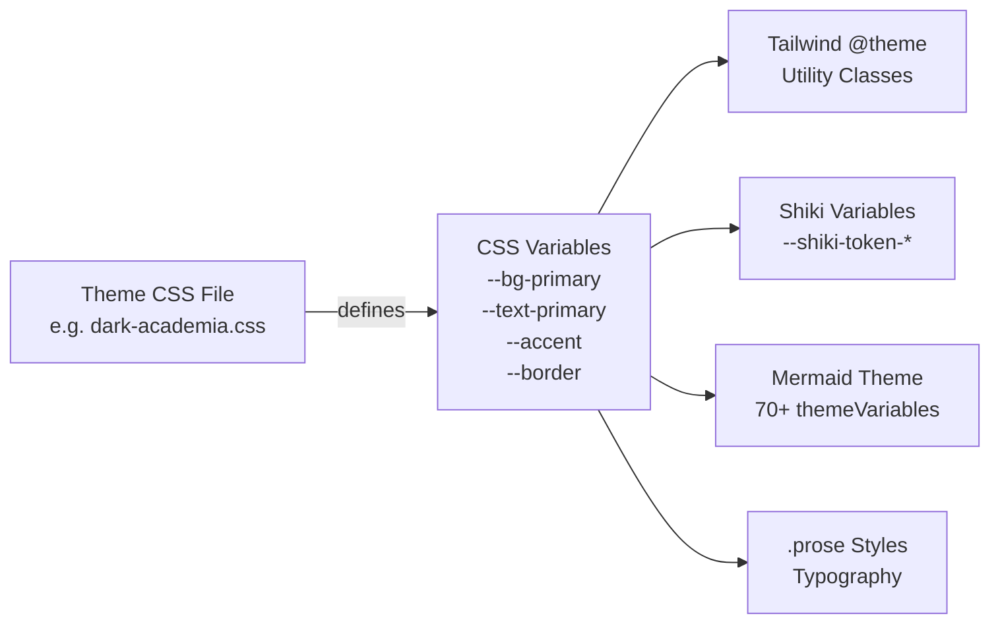

# Architecture

## System Overview

```mermaid
graph TB
    subgraph Backend["Go Backend (WSL @ 8130)"]
        Router["Chi Router"]
        FilesAPI["/api/files/*"]
        GitAPI["/api/git/*"]
        ChatAPI["/api/chat/*"]
        Hub["WebSocket Hub"]
        FileWatch["fsnotify Watcher"]
        SQLite["SQLite DB"]
        Claude["Claude CLI"]

        Router --> FilesAPI
        Router --> GitAPI
        Router --> ChatAPI
        Router --> Hub
        Hub --> FileWatch
        ChatAPI --> Claude
        ChatAPI --> SQLite
    end

    subgraph Browser["Browser (React 19)"]
        App["App.tsx"]
        Files["Files.tsx"]
        Hooks["Hooks Layer"]
        State["Context / State"]
    end

    subgraph TabzChrome["TabzChrome @ 8129 (Optional)"]
        Spawn["Spawn Terminals"]
    end

    Files -->|REST| FilesAPI
    Files -->|REST| GitAPI
    Hooks -->|SSE| ChatAPI
    Hooks <-->|WebSocket| Hub
    Files -.-> Spawn
```

## Frontend Components

```mermaid
graph TB
    App["App.tsx<br/>Routing + Themes"]
    App --> Landing["Landing Page"]
    App --> Files["Files Page"]

    Files --> NavHeader["NavHeader<br/>Theme + Project Selectors"]
    Files --> Sidebar["Sidebar<br/>File Tree, Search, Filters"]
    Files --> Toolbar["Toolbar<br/>Open, Copy, Follow AI"]
    Files --> SplitView["SplitView<br/>Drag Resize"]
    Files --> ViewerContainer["ViewerContainer<br/>File Type Dispatch"]

    ViewerContainer --> MV["MarkdownViewer<br/>Streamdown + Shiki"]
    ViewerContainer --> CodeViewer["CodeViewer<br/>Shiki Highlighting"]
    ViewerContainer --> JsonViewer["JsonViewer"]
    ViewerContainer --> CsvViewer["CsvViewer"]
    ViewerContainer --> ImageViewer["ImageViewer"]
    ViewerContainer --> SvgViewer["SvgViewer"]
    ViewerContainer --> PdfViewer["PdfViewer"]
    ViewerContainer --> DiffViewer["DiffViewer"]

    Files --> ChatPanel["ChatPanel<br/>AI Chat"]
    ChatPanel --> ChatInput["ChatInput"]
    ChatPanel --> ChatMessage["ChatMessage"]

    Files --> GitGraph["GitGraph<br/>Canvas Rails"]
    Files --> WorkingTree["WorkingTree"]
```

## Data Flow

```mermaid
graph TB
    subgraph Realtime["Real-time Data"]
        WS["WebSocket"]
        SSE["SSE Stream"]
    end

    subgraph Hooks["React Hooks"]
        useFileWatcher["useFileWatcher<br/>Subscribe to file changes"]
        useWorkspaceStream["useWorkspaceStreaming<br/>Follow AI Edits"]
        useAIChat["useAIChat<br/>Chat + streaming"]
        useDiffScroll["useDiffAutoScroll<br/>Scroll to changes"]
        useGitDiff["useGitDiff<br/>Diff highlighting"]
    end

    subgraph Context["React Context"]
        AppStore["AppStoreContext<br/>localStorage: theme, favorites"]
        AIChatCtx["AIChatContext<br/>Chat state app-wide"]
        WorkspaceCtx["WorkspaceContext<br/>File tree + path"]
        PageState["PageStateContext<br/>Tabs, split, chat tabs"]
    end

    WS -->|"file-watch /<br/>file-change"| useFileWatcher
    WS -->|"workspace-watch /<br/>workspace-file-change"| useWorkspaceStream
    SSE -->|"Claude response<br/>tokens"| useAIChat

    useFileWatcher -->|"content + isStreaming"| useDiffScroll
    useFileWatcher -->|"content settled"| useGitDiff
    useAIChat --> AIChatCtx
    useWorkspaceStream -->|"auto-open file"| WorkspaceCtx
```

## Theming

```mermaid
graph LR
    ThemeCSS["Theme CSS File<br/>e.g. dark-academia.css"]
    ThemeCSS -->|defines| Vars["CSS Variables<br/>--bg-primary<br/>--text-primary<br/>--accent<br/>--border"]
    Vars --> Tailwind["Tailwind @theme<br/>Utility Classes"]
    Vars --> Shiki["Shiki Variables<br/>--shiki-token-*"]
    Vars --> Mermaid["Mermaid Theme<br/>70+ themeVariables"]
    Vars --> Prose[".prose Styles<br/>Typography"]
```
